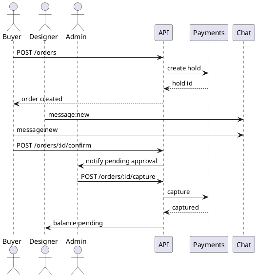

# Архитектура Prince Production

## Обзор

Платформа состоит из Next.js фронтенда (App Router) и NestJS бэкенда с Prisma ORM. Компоненты объединены в монорепозиторий на pnpm workspaces.

> Изображение можно сгенерировать по схеме ниже. Файл-заглушка отсутствует намеренно.

## Слои

- **Клиент** — Next.js с Tailwind, Zustand для состояния, WebSocket клиент для чатов, интеграция с Telegram WebApp.
- **API** — NestJS модули: каталог, заказы, дизайнеры, платежи, чаты, админ.
- **База данных** — PostgreSQL + Prisma. Redis для очередей/сессий (см. `docs/infrastructure.md`).
- **Файлы** — S3-совместимое хранилище (presigned URLs).

## Потоки

1. **Заказ**: фронт → `/orders` (создание, холд) → чат → подтверждение → capture.
2. **Заявка дизайнера**: фронт → `/designer-applications` → админ → approve → назначение.
3. **Админ управление**: веб → `/admin/*` эндпоинты → изменение каталога, статусов, логирование.

## Модули API

- `CatalogModule` — публичный каталог и админ CRUD.
- `OrdersModule` — создание/управление заказами, статусы.
- `DesignersModule` — заявки и статусы дизайнеров.
- `PaymentsModule` — эскроу (hold/capture/refund), интеграция с провайдером.
- `ChatModule` — WebSocket шлюз Socket.IO.
- `AdminModule` — обзоры, метрики, логи.

## Безопасность

- JWT + Telegram initData (планируется).
- RBAC на уровне guard'ов.
- Маскирование контактов в чатах.
- Валидация входных данных через class-validator/zod.

## Telegram

- WebApp: проверка подписи initData, получение токена с бэка.
- Bot notifications: BullMQ очередь + Telegram Bot API.
- Deep links: генерация URL `https://t.me/<bot>?start=designer_app_<id>`.

## Диаграммы

- ERD — см. `prisma/schema.prisma`.
- Последовательности (plantuml):

